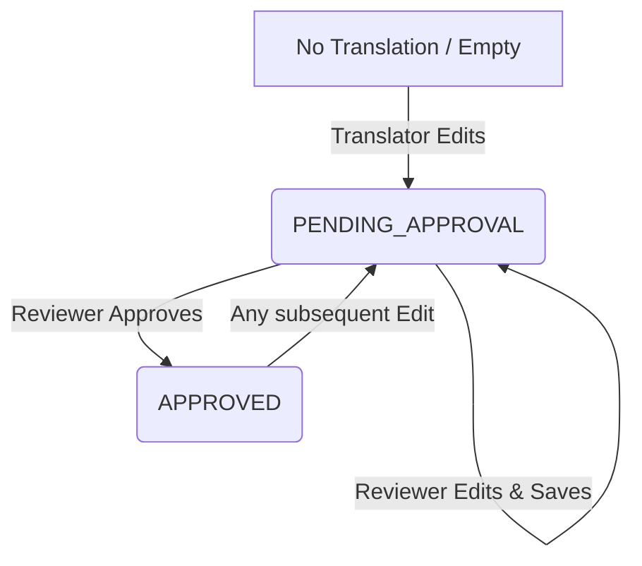

# ⚖️ Approval and Review Workflow

This feature allows reviewers to control translation quality and import translation files in bulk, ensuring only validated texts make it into the production environment.

---

## 🔄 State Flow

*   **`PENDING_APPROVAL`**: Indicates the translation was suggested or updated by a translator but has not yet been approved.
*   **`APPROVED`**: Indicates the translation is verified and ready for game client consumption. Only approved translations are exported.

---

## 🚀 API Endpoints

### 1. List Translations Pending Approval
*   **URL**: `/api/translations/pending`
*   **Method**: `GET`
*   **Access**: `REVIEWER` only
*   **Response**: Returns a list of translation documents that contain at least one locale with status `PENDING_APPROVAL`.

### 2. Approve Translation
*   **URL**: `/api/translations/{version}/{keyCode}/{locale}/approve`
*   **Method**: `POST`
*   **Access**: `REVIEWER` only
*   **Behavior**: Updates the translation status to `APPROVED` and logs an `APPROVE` entry in the key's history.

### 3. Bulk Import Translations
*   **URL**: `/api/translations/import`
*   **Method**: `POST`
*   **Access**: `REVIEWER` only
*   **Behavior**: Allows uploading or submitting translations in bulk to populate the dictionary.

---

## 🛠️ Implementation Details

### Backend
*   **`TranslationService.java`**:
    *   `getPendingTranslations()` queries MongoDB for keys with translations having status `PENDING_APPROVAL`.
    *   `approveTranslation()` loads the document, updates the target locale status to `APPROVED`, adds an `APPROVE` history entry, and saves the document.

### Frontend
*   **`ReviewQueueComponent`**:
    *   A review queue interface restricted to reviewers.
    *   Displays the source text (`baseValue`), the suggested translation, the modifier, and quick approval buttons.
    *   Provides a comparison diff between the previous translation value and the new value.
