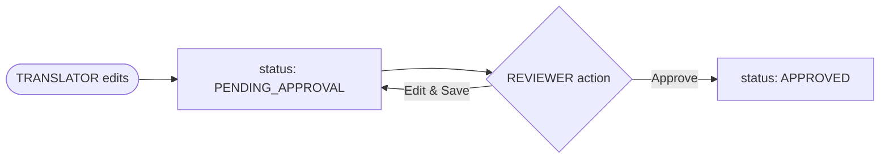

# Implementation Plan: Translation Nexus

Derived from [agent.md](file:///g:/dev/projects/translation-nexus/agent.md).

---

## Overview

A translation management tool with two independently runnable applications:

| Part | Technology | Port |
|---|---|---|
| Backend API | Java 21 + Spring Boot 4 + Spring Data MongoDB + Spring Security (JWT) | `8080` |
| Frontend SPA | Angular 17+ | `4200` |
| Database | MongoDB | `27017` |

---

## Project Structure

```
translation-nexus/
├── agent.md
├── agent/
│   └── plan/
│       └── implementation_plan.md  ← this file
│   └── features/ 
│       └── *.md                    ← system features
├── backend/                        ← Spring Boot project
└── frontend/                       ← Angular project
```
---

## Agent Instructions

- All features should be saved in `features/` folder as markdown files and have the extension `.md`

## Proposed Changes

### Backend — `translation-nexus/backend/`

#### [NEW] Maven Project (`pom.xml`)

Dependencies:
- `spring-boot-starter-web`
- `spring-boot-starter-data-mongodb`
- `spring-boot-starter-security`
- `jjwt-api` / `jjwt-impl` / `jjwt-jackson` (JJWT 0.12.x)
- `lombok`
- `spring-boot-starter-validation`

---

#### [NEW] Package Structure

```
dev.mooka.translationnexus
├── config/
│   ├── SecurityConfig.java         ← JWT filter chain, CORS, role-based access
│   └── MongoConfig.java            ← Compound index setup
├── domain/
│   ├── TranslationDocument.java    ← Main MongoDB document
│   ├── TranslationValue.java       ← Embedded: per-locale value + status
│   ├── HistoryEntry.java           ← Embedded: audit trail entry
│   └── User.java                   ← MongoDB user document (users collection)
├── repository/
│   ├── TranslationRepository.java
│   └── UserRepository.java
├── service/
│   ├── TranslationService.java     ← Core business logic + placeholder validation
│   ├── AuthService.java            ← Login → JWT generation
│   └── ExportService.java          ← Builds key→value map for export
├── resource/
│   ├── controller/
│   │   ├── AuthController.java
│   │   ├── TranslationController.java
│   │   └── ExportController.java
│   └── dto/
│       ├── LoginRequest.java
│       ├── LoginResponse.java
│       ├── TranslationKeyCreateDTO.java
│       ├── TranslationUpdateDTO.java
│       └── TranslationResponseDTO.java
├── security/
│   ├── JwtTokenProvider.java       ← Sign / parse JWT
│   └── JwtAuthFilter.java          ← OncePerRequestFilter
└── core/
    └── PlaceholderValidator.java   ← Regex {placeholder} validator
```

---

#### [NEW] `TranslationDocument.java`

```java
@Document(collection = "translations")
@CompoundIndex(def = "{'keyCode': 1, 'version': 1}", unique = true)
public class TranslationDocument {
    @Id private String id;
    private String keyCode;
    private String version;
    private String category;
    private List<String> tags;
    private String contextInfo;
    private String baseValue;                        // English source text
    private Map<String, TranslationValue> translations = new HashMap<>();
    private List<HistoryEntry> history = new ArrayList<>();
}
```

#### [NEW] `TranslationValue.java` (embedded)

```java
public class TranslationValue {
    private String translatedValue;
    private String status;           // PENDING_APPROVAL | APPROVED
    private String lastModifiedBy;
    private Instant updatedAt;
}
```

#### [NEW] `HistoryEntry.java` (embedded)

```java
public class HistoryEntry {
    private String locale;
    private String modifiedBy;
    private String previousValue;
    private String newValue;
    private String action;           // EDIT | APPROVE
    private Instant timestamp;
}
```

#### [NEW] `User.java`

```java
@Document(collection = "users")
public class User {
    @Id private String id;
    private String username;
    private String passwordHash;
    private String role;             // TRANSLATOR | REVIEWER
}
```

---

#### [NEW] Security & JWT

- **`SecurityConfig`**: Stateless session, permit `POST /api/auth/login`, require `REVIEWER` for `/api/translations/pending` and `/approve`, require auth for everything else.
- **`JwtTokenProvider`**: Signs tokens with a secret key from `application.properties`, 24h expiry.
- **`JwtAuthFilter`**: Reads `Authorization: Bearer <token>`, validates and sets `SecurityContext`.

---

#### [NEW] `PlaceholderValidator.java`

Regex: `\{([^}]+)\}` — extracts all `{name}` tokens from both source and translated strings and asserts they are identical sets.

---

#### [NEW] REST Endpoints (all under `/api`)

| Method | Path | Role | Description |
|---|---|---|---|
| `POST` | `/auth/login` | Public | Returns JWT + role |
| `POST` | `/translations/keys` | REVIEWER | Create a new translation key |
| `GET` | `/translations?version=&tag=&category=&page=&size=` | Any | Paged key list with filters |
| `PUT` | `/translations/{version}/{keyCode}/{locale}` | TRANSLATOR, REVIEWER | Save/update a translation |
| `GET` | `/translations/pending` | REVIEWER | All items with `PENDING_APPROVAL` |
| `POST` | `/translations/{version}/{keyCode}/{locale}/approve` | REVIEWER | Approve a pending translation |
| `GET` | `/translations/{version}/{keyCode}/history` | Any | Full audit history for a key |
| `GET` | `/export/{locale}/{version}?format=json` | Any | Export approved key→value map |

---

#### Approval Flow



---

### Frontend — `translation-nexus/frontend/`

Angular 17+ standalone components (no NgModules), `HttpClient`, `ReactiveFormsModule`.

#### [NEW] App Routes

| Path | Component | Guard |
|---|---|---|
| `/login` | `LoginComponent` | — |
| `/translations` | `TranslationListComponent` | `authGuard` |
| `/review` | `ReviewQueueComponent` | `reviewerGuard` (REVIEWER only) |

#### [NEW] Key Components

- **`LoginComponent`**: Username + password form → `POST /api/auth/login` → stores JWT + role in `localStorage`.
- **`TranslationListComponent`**: Table with filters (version selector, tag chips, category, search). Each row shows `keyCode`, `baseValue`, per-locale translation input with inline save.
- **`ReviewQueueComponent`**: Shows all `PENDING_APPROVAL` items. For each: previous value, new value diff, who translated it, when. Approve button calls `/approve`.
- **`AuthInterceptor`**: Attaches `Authorization: Bearer <token>` to every outgoing request.

---

## Verification Plan

### Automated
- Run `mvn test` (unit tests for `PlaceholderValidator` and `TranslationService`).
- Verify MongoDB compound index enforcement (duplicate `keyCode+version` should return `409`).

### Manual
- Login as `TRANSLATOR` → save a translation → confirm status is `PENDING_APPROVAL`.
- Login as `REVIEWER` → see item in Review Queue → approve → confirm status is `APPROVED`.
- Call `/export/pt/1.0.0?format=json` → verify only `APPROVED` keys are in the output.
- Attempt to save a translation with a missing placeholder → confirm `400 Bad Request`.
